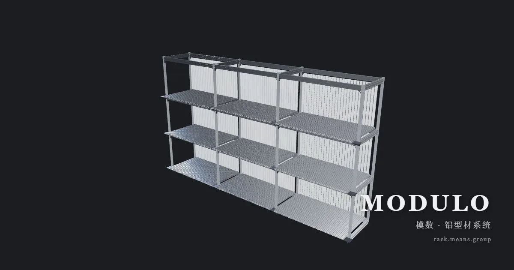
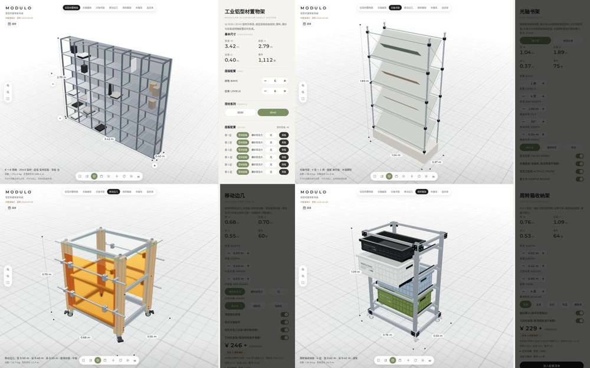

# MODULO 模数 · Parametric 3D Configurator for Aluminum Extrusion Systems

<p align="center">
  
</p>

<p align="center">
  <strong>🌐 Live Demo / 在线体验：<a href="https://rack.means.group">rack.means.group</a></strong><br>
  完全在浏览器端程序化建模的实时产品配置器 · Real-time product configurator with fully procedural in-browser 3D modeling
</p>

**English**: A parametric 3D configurator for modular aluminum-extrusion / linear-shaft furniture systems. Every mesh is generated procedurally at runtime — zero external model files. `npm run build` outputs a **single** `dist/index.html` that works offline by double-clicking. Real-time BOM: profile cut lengths × cross-section area × density → weight, cut list export (SpreadsheetML, opens in Excel/WPS), and a live pricing engine.

**中文**：全部几何体运行时生成，零外部模型文件；`npm run build` 产出**单个** `dist/index.html`，可离线双击打开。实时算料（截面净面积 × 长度 × 密度 → 自重）、算料单导出、BOM × 单价实时估价。

## Screenshots / 截图



*左上：工业铝型材置物架 · 右上：光轴书架 · 左下：移动边几 · 右下：周转箱收纳架*
*Top-left: aluminum shelving · Top-right: rod bookshelf · Bottom-left: rolling cart · Bottom-right: crate storage rack*

## 产品线 Products

| # | 产品 Product | 入口 Route | 说明 |
|---|---|---|---|
| 1 | 工业铝型材置物架 Aluminum shelving | `#`（默认） | 真实 T-slot 截面，逐层逐跨参数化装配 |
| 2 | 光轴展架 Rod display stand | `#rod` | 单排双柱展示架，三种样式（海报 / 双联展板 / 亚克力展示屏） |
| 3 | 光轴书架 Rod bookshelf | `#books` | 铬管框架斜面展板书架 / 阅读长桌 |
| 4 | 移动边几 Rolling cart | `#cart` | 木纹立柱 + 玻璃台面 + 亚克力中板与挂杆立板 + 光轴挂杆 + 万向轮 |
| 5 | 周转箱收纳架 Crate storage rack | `#crates` | 铝架 + 三节钢珠滑轨抽拉式物流周转箱，多配色、层数可调 |
| 6 | 光轴木展车 Wooden display cart | `#woodcart` | 胶合板底台 + 洞洞板展墙 + 层板/顶台板 + 卡片挂杆与顶部挂架 |
| 7 | 光轴挂衣架 Rod hanger rack | `#hanger` | 两种样式：光轴抽屉柜 / 原木水磨石 |

> 另有 `#node` 精确节点视角（GLB 同构装配模式），用于对照原始模型结构。
> 产品之间通过右上角标签页或 URL hash 切换。Switch products via top-right tabs or URL hash.

## 功能 Features

- **参数化装配 Parametric assembly**：尺寸、层数、跨数、配色、附件开关实时重建，面板与 3D 同步。Dimensions, bays, levels, finishes and accessories rebuild live, panel and 3D in sync.
- **实时算料 Real-time BOM**：截面净面积 × 长度 × 密度实算自重，算料单导出（SpreadsheetML，Excel / WPS 直接打开）。Weight from net cross-section area × length × density; cut-list export opens in Excel/WPS.
- **材料估价 Live pricing**：BOM × 单价引擎，支持远程价格表（KV）/ 内置表回退，未计价项单独标注。BOM × price engine with remote price table (KV) and built-in fallback.
- **模型导出 GLB export**：当前装配导出 `.glb`（导出前把 InstancedMesh 逐实例展平，保证通用查看器里形体完整）。Exports current assembly to `.glb`, instances flattened for compatibility.
- **3D 交互 Interaction**：左键旋转 / 右键平移 / 滚轮缩放，WASDQE 键盘平移；尺寸标注、± 悬浮热点、多相机预设、爆炸视图、自转。Orbit/pan/zoom, dimension lines, hotspots, camera presets, exploded view, auto-rotate.
- **渲染管线 Rendering**：程序化摄影棚环境光照（PMREM）+ ACES 色调映射 + 轻量暗角；可选 GTAO 环境光遮蔽（`?ao`）。Procedural studio HDRI (PMREM) + ACES tone mapping.
- **配置持久化 Persistence**：URL hash permalink + localStorage（按产品隔离）。
- **离线可用 Offline-first**：单文件构建，WebGL 不可用时仍可算料；尊重系统「减少动态效果」设置。

## 快速开始 Quick Start

```powershell
npm install
npm run dev              # 开发预览 dev preview
npm run build            # 产出单文件 dist/index.html (single-file offline build)
npm test                 # 单元测试 unit tests (node:test)
node tools/qa-browser.mjs   # 真机浏览器 QA：产品渲染 / 交互 / console 错误
node tools/qa-geometry.mjs  # 几何约束断言（无需浏览器）
node tools/qa-export.mjs    # 模型导出形体校验
```

## 部署 Deploy

推送 `main` 会自动部署到 Cloudflare Workers（GitHub Actions，见下）；也可以在本地手动部署：

```powershell
npm run build
npx wrangler deploy --config wrangler.local.toml
```

- 线上架构：`rack.means.group` → Vercel 边缘反向代理（纯 rewrite）→ Cloudflare Worker（静态资产 + `/api/market` 价格表）。Vercel 那层无需重新部署。
- 自动部署只对「非文档改动」生效，且需要先在仓库配置 2 个 Secrets（缺失时会自动跳过，不报错）
- 详细步骤、配置文件分工、Secrets 清单：见 **[docs/deployment.md](docs/deployment.md)**
- 反代架构与踩坑记录：见 [docs/vercel-reverse-proxy.md](docs/vercel-reverse-proxy.md)
- 出问题怎么退：见 **[docs/rollback.md](docs/rollback.md)**（六个回滚场景）

## 目录结构 Structure

```
├── index.html               入口 HTML（含 file:// 跳转守卫）
├── worker.js                Cloudflare Worker：/api/market + 静态资产兜底
├── wrangler.toml            Worker 部署配置（公开版，标识符为占位符）
├── vite.config.js           Vite + vite-plugin-singlefile
├── docs/                    部署说明 / 反代记录 / 设计计划 / screenshots
├── md/                      GLB 逆向参数与评审笔记
├── model/                   结构提取脚本与截面数据
├── public/                  静态资源（favicon、OG 图）
├── test/                    单元测试
├── tools/                   QA 脚本与价格表
└── src/
    ├── main.js              产品接线 / 防抖重建 / 渲染循环
    ├── styles.css           设计 token 与组件样式
    ├── config/              各产品唯一配置源（product 型材 / rodrack 光轴 /
    │                        cart 边几 / crates 周转箱 / woodcart 木展车 / market 价格）
    ├── core/                几何与场景：profiles（T-slot 截面）、各 buildXxx 装配、
    │                        materials、scene、postfx、anims、dimensions、hotspots、joints
    └── ui/                  面板与状态：各 xxxPanel、store、persist、hud、
                             cutlist（算料）、marketPrice（估价）、modelExport、dragSlider
```

## 技术说明 Tech Notes

- 自重实算：截面净面积 × 长度 × 密度（铝 2700 / 钢 7850 kg/m³）+ 五金示例单重。
- 大量零件用 `InstancedMesh` 承载，整机 draw call 保持个位数到几十。
- 光轴展架结构基准来自 GLB 逆向数据（`assets_src/guangzhou02-parts.json`），改动结构前建议先读它。
- 单文件构建：`vite-plugin-singlefile` 把 JS / CSS / 贴图全部内联。
- 报价与承重均为**演示示例**，页面已标注，不作为加工、采购或承重依据。
- 价格数据契约：远端价格表 `tools/price_table.json` 是**唯一权威源**（改价须改此文件并提交 git，再 `wrangler kv key put`）。
  其 `match` 字段是**正则源码字符串**（JSON 无法承载 RegExp）；worker 边缘做 schema 校验，
  前端 `marketRemote.js` 再清洗一道——任一项 `match` 不可编译或 `price` 非法即丢弃该项、整表非法回退内置表，坏数据永不进入报价。

## 许可 License

[MIT](LICENSE)
